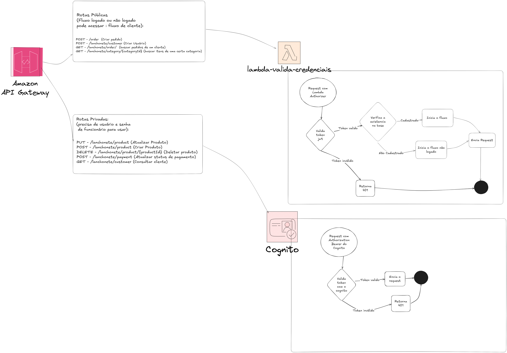
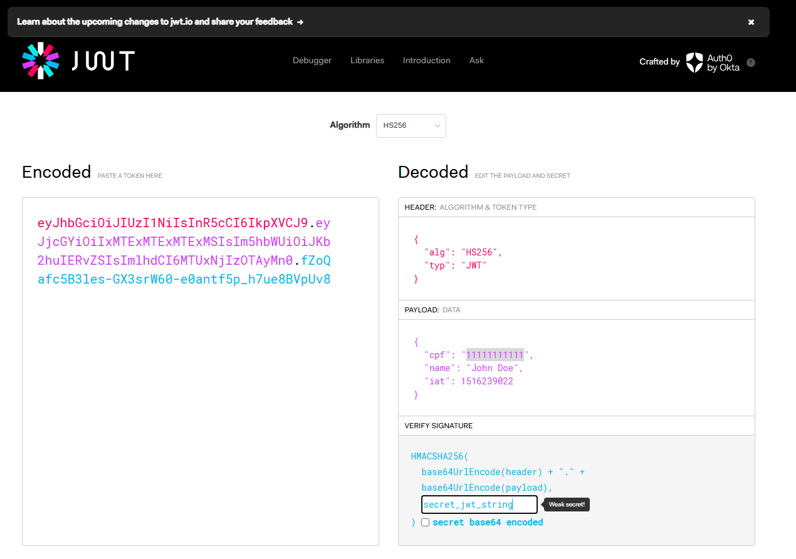
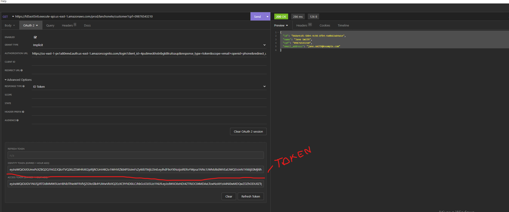
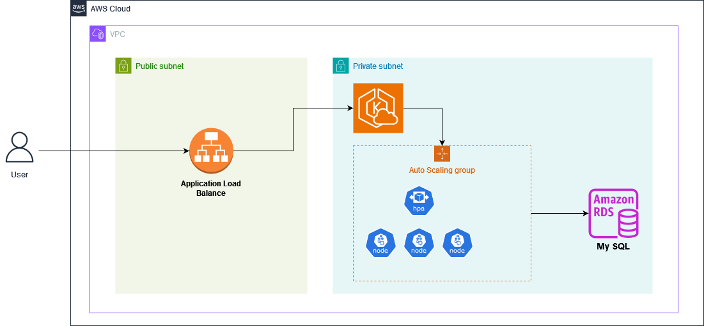

<h1 align="center">
  Tech Challenge 03
</h1>

Monolito para gestão de autoatendimento para lanchonetes. Este desafio faz parte da Fase 3 - Distribuição da Aplicação

## Colaboradores

- Vinícius Teixeira Sant' Anna - vinitsantanna@gmail.com - RM357722
- Welington Carlos Alves de Almeida Filho - wcfilho98@gmail.com - RM357115
- Ludionei da Penha dos Reis - ludioneireis@gmail.com - RM357306
- Francisco Washington de Almeida Oliveira - franciscowashington59@gmail.com - RM357075
- Charles Aparecido da Paixão de Jesus Campagnaro - charles.campag@gmail.com - RM357029

## Repos das entregas da fase 3:

- [Repo Lambda Authorizer](https://github.com/software-arc-group/lambda-api-authenticator)
- [Repo Infraestrutura e Kubernetes](https://github.com/software-arc-group/techchalenge-eks-terraform-infrastructure)
- [Repo Infraestrutura Banco de Dados](https://github.com/software-arc-group/infra-terraform-database)

Tanto os Repos do **Repo Infraestrutura e Kubernetes**  quanto o repositório de **Repo Infraestrutura Banco de Dados** tem a mesma esteira configurada: esteira terraform. As actions são ativadas quando abrem um PR para main (executando o terraform plan)
e quando fecham o PR para a main (executando o terraform apply). 

O Repositório de da lambda **Repo Lambda Authorizer** tem uma esteira baseada em comandos aws cli. Ele verifica a existencia da lambda na conta, caso não exista, ela cria uma lambda nova, caso já exista ela atualiza a lambda. Também baixa todas as dependencias em tempo de execução da esteira, consultando o arquivo requirements.txt

Já esse repositório executa atualiza o código do ecr e força atualiza o EKS reexecutando todos os yamls dentro da pasta kuber em qualquer branch que ocorra um push ou um PR e atualiza o gráfico de dependencias da aplicação.

## Métodos de Autorização:



Existem 2 métodos de autenticação:

1 - Lambda authorization - para os clientes da Loja.
2 - Cognito para os funcionários da loja.

- No método 1 utilizamos uma lambda para validar o token do campo *Authorization* do Header da requisição, nele encontramos um token que é criptografado com o algoritmo: HS256, utilizando uma chave simétrica entre o "frontend" e o "backend"
. Escolhemos esse método de autenticação dado que o requisitos da entrega não davam nenhum detalhe de como seria a implementação da autenticação. A lambda apenas valida se o token está criptografado com a seguinte chave: "secret_jwt_string". Caso esteja criptografado com essa chave o request é considerado valido, e vai entrar no fluxo *logado* ou *não logado*. Porém caso o secret esteja incorreto o retorno será um Código Unauthorized (401).
Caso a chave esteja correta e o usuário tenha a chave: cpf: "11111111111"( Chave de CPF cadastrado )no payload do token ele entrará no fluxo *logado* da lambda. Caso não tenha um campo cpf no payload ou tenha o campo cpf, mas ele não é um cpf cadastrado no programa, ele será redirecionado para o fluxo *não logado*.

Exemplo de criação de token valido usando o site: [jwt.io](https://jwt.io/):


- No método 2 utilizamos o cognito para gerenciamento do poll de usuários. Esse fluxo de autenticação será utilizado para os funcionários da loja e exige uso de usuário e senha para entrar no ambiente logado. De forma que o usuário possa efetuar ações para gerenciamento de Produtos oferecidos, status de pedidos entre outras ações.
Nesse método de autentificação geramos um token atráves de uma url de login do cognito e passamos esse token header *Authorization* do request. Esse header será validado pelo próprio Cognito e caso contenha um token correto permitirá o acesso a aplicação.

Segue um exemplo de como gerar o token no cognito:



## Infraestrutura Kubernetes



## Video no Youtube com explicação da Infraestrutura:
- [Infraestrutura Kubernetes](https://www.youtube.com/watch?v=cu73283Rkl0)
## Tecnologias

- [Java](https://docs.oracle.com/en/java/javase/17/)
- [Spring Boot](https://spring.io/projects/spring-boot)
- [Spring Boot docker-compose](https://spring.io/blog/2023/06/21/docker-compose-support-in-spring-boot-3-1)
- [MySql](https://dev.mysql.com/doc/)
- [Liquibase](https://docs.liquibase.com/home.html)
- [Swagger](https://swagger.io/docs/)
- [QR Code do Mercado Pago](https://www.mercadopago.com.br/developers/pt/reference/qr-dynamic/_instore_orders_qr_seller_collectors_user_id_pos_external_pos_id_qrs/post)


## Práticas adotadas

- Domain-Driven Design (DDD)
- Arquitetura Limpa
- Consultas com filtros dinâmicos
- API reativa na web e na camada de banco
- Uso de DTOs para a API
- Geração automática do Swagger

## Configuração do Ambiente

### Variáveis de Ambiente

- `SPRING.DATASOURCE.URL`: URL de conexão com o banco de dados.
- `SPRING.DATASOURCE.USERNAME`: Usuário do banco de dados.
- `SPRING.DATASOURCE.PASSWORD`: Senha do banco de dados.
- `INTEGRATION.MERCADOPAGO.URL`: URL da API do MercadoPago.
- `INTEGRATION.MERCADOPAGO.ACCESSTOKEN`: Token de acesso da API do MercadoPago.

## Pré-requisitos

Antes de iniciar o projeto, certifique-se de que você possui os seguintes pré-requisitos instalados e configurados:

### 1. [Kubectl](https://kubernetes.io/docs/tasks/tools/)
- Ferramenta de linha de comando para interagir com clusters Kubernetes.
- **Instalação no Windows*:
  ```bash
  choco install kubernetes-cli

### 2. [Minikube](https://minikube.sigs.k8s.io/docs/)
- Ferramenta para executar um cluster Kubernetes local.
- **Instalação no Windows*:
  ```bash
  choco install minikube
### 3. Verificando a instalação
- Depois de instalar os pré-requisitos, você pode verificar se tudo está configurado corretamente rodando os seguintes comandos:
- **Instalação no Windows*:
  ```bash
   minikube start
   kubectl version --client
   minikube status
  
### Executando o Cluster Kubernetes

1. Na pasta raiz do projeto execute:
``` sh
kubectl apply -f kuber
```

2. Valide se os containers estão READY:
``` sh
kubectl get pods
```
3. Execute o comando abaixo para conectar a sua rede local a rede do Minikube
``` sh
   minikube tunnel
```

## Documentação
A documentação da API pode ser acessada pelo [Swagger](http://localhost:8080/swagger-ui.html) quando a aplicação está em execução.


## APIs

### Criar cliente
- Método: POST
- Endpoint: `/lanchonete/customer`
- Descricação: Cria um cliente novo
- Request Body:

```json
{
  "name": "string",
  "cpf": "11111111111",
  "email_address": "string"
}
```

### Buscar o cliente
- Método: GET
- Endpoint: `/lanchonete/customer/{cpf}`
- Parâmetro: `cpf`
- Descricação: Busca um cliente por cpf
- Response Body:
```json
{
  "id": "UUID do cliente",
  "name": "string",
  "cpf": "11111111111",
  "email_address": "string"
}

```

### Buscar produto por categoria
- Método: GET
- Endpoint: `/lanchonete/category/{categoryId}`
- Parâmetro: `categoryId`
- Descricação: Busca os produtos por uma categoria
- Response Body:
```json
{
  "description": "string",
  "products": [
    {
      "product_id": "3fa85f64-5717-4562-b3fc-2c963f66afa6",
      "category_id": "3fa85f64-5717-4562-b3fc-2c963f66afa6",
      "name": "string",
      "price": 0,
      "description": "string"
    }
  ],
  "productCategoryId": "3fa85f64-5717-4562-b3fc-2c963f66afa6"
}

```


### Criar produto
- Método: POST
- Endpoint: `/lanchonete/product`
- Descricação: Cria um novo produto
- Request Body:

```json
{
  "category_id": "3fa85f64-5717-4562-b3fc-2c963f66afa6",
  "name": "string",
  "price": 0,
  "description": "string"
}
```

### Alterar produto
- Método: PUT
- Endpoint: `/lanchonete/product`
- Descricação: Altera um produto
- Request Body:

```json
{
  "product_id": "3fa85f64-5717-4562-b3fc-2c963f66afa6",
  "category_id": "3fa85f64-5717-4562-b3fc-2c963f66afa6",
  "name": "string",
  "price": 0,
  "description": "string"
}
```

### Deleta um produto
- Método: DELETE
- Endpoint: `/lanchonete/product`
- Parâmetro: `productId`
- Descricação: Deleta um produto
- Request Body: `204 No Content`


### Enviar pedido
- Método: POST
- Endpoint: `/lanchonete/order`
- Descricação: Cria novo pedido
- Request Body:
```json
{
  "orderSnackId": "3fa85f64-5717-4562-b3fc-2c963f66afa6",
  "progress": "string",
  "createdAt": "2024-08-10T20:41:40.553Z",
  "customerId": "3fa85f64-5717-4562-b3fc-2c963f66afa6",
  "customerName": "string",
  "cpf": "string",
  "items": [
    {
      "orderSnackItemId": "3fa85f64-5717-4562-b3fc-2c963f66afa6",
      "amount": 0,
      "productName": "string",
      "price": 0,
      "quantity": 1,
      "product_id": "3fa85f64-5717-4562-b3fc-2c963f66afa6"
    }
  ]
}
```


### Listar pedidos
- Método: GET
- Endpoint: `/lanchonete/ordersnack?progress{progress}&cpf{cpf}`
- Parâmetro: Valores opcionais `progress` e `cpf`
- Descricação: Lista todos os pedidos
- Response Body:
```json
[
  {
    "orderSnackId": "3fa85f64-5717-4562-b3fc-2c963f66afa6",
    "progress": "string",
    "createdAt": "2024-08-10T20:50:50.244Z",
    "customerId": "3fa85f64-5717-4562-b3fc-2c963f66afa6",
    "customerName": "string",
    "cpf": "string",
    "items": [
      {
        "orderSnackItemId": "3fa85f64-5717-4562-b3fc-2c963f66afa6",
        "amount": 0,
        "productName": "string",
        "price": 0,
        "quantity": 1,
        "product_id": "3fa85f64-5717-4562-b3fc-2c963f66afa6"
      }
    ]
  }
]

```

## Licença

Este projeto é licenciado sob a MIT License - veja o arquivo [LICENSE](https://opensource.org/license/mit) para mais detalhes.
